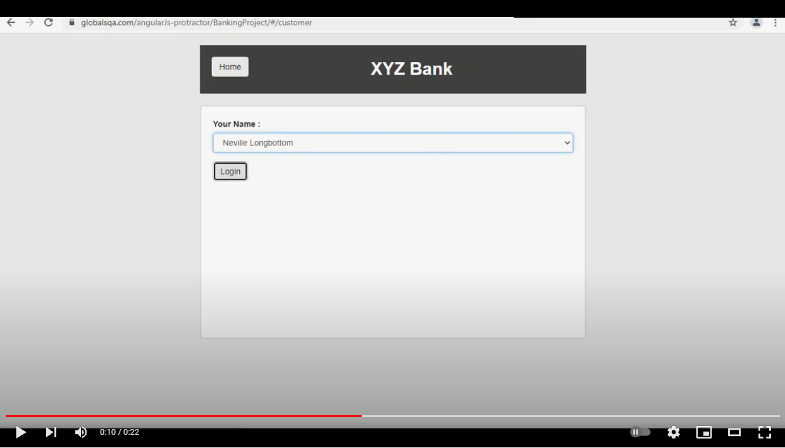

## Тестовое задание на должность QA Automation Engineer в Кубань-кредит банке
- Настроить проект с Maven в качестве платформы для сборки
- Добавить Selenide, TestNG, REST-ASSURED в зависимости Maven
- С помощью Selenide открыть и написать пару авто тестов для сайта https://www.globalsqa.com/angularJs-protractor/BankingProject/
- Кейсы можно писать любые, но обязательно надо написать кейс на логин под обычным пользователем

### Требования к ПО
- Java 15 (JDK 15.0.2) старше - [https://www.java.com/ru/download/](https://www.java.com)
- Testng 7.3.0 и старше [https://testng.org/doc/download.html](https://testng.org)
- Selenide 5.25.0 и старше [https://ru.selenide.org/quick-start.html](https://ru.selenide.org)
- Maven 4.0.0 и старше [https://maven.apache.org/download.cgi](https://maven.apache.org)

### Тест-кейс №1

| Test ID  | Name                                             |  Precondition                           |                    
| -------- | ------------------------------------------------ |-----------------------------------------|  
| Log1     | Проверка авторизации в системе                   |Открыть страницу https://www.globalsqa.com/angularJs-protractor/BankingProject/              |

|Test to reproduce         |	Expected Result	            |Status (passed,skipped, failed, bloked)|
| ------------------------ | ------------------------------ | ---------- | 
|1. Нажать на кнопку "Сustomer Login"|	Открылась страница https://www.globalsqa.com/angularJs-protractor/BankingProject/#/customer|	pass|
|3. В поле "Your Name" выбрать "Albus Dumbledore"|	Должна отобразиться кнопка "Login"| 	pass|
|4. Очистить поле "Your Name" |	Поле ввода "Login" стало невидимым|	pass|
|5. В поле "Your Name" выбрать "Neville Longbottom"|	Должна отобразиться кнопка "Login"|	pass|
|6. Нажать на кнопку "Login"|	Открылась страница https://www.globalsqa.com/angularJs-protractor/BankingProject/#/account|	pass|
|7. Проверить наличие надписи Welcome "Neville Longbottom" |	Надпись найдена|	pass|

### Тест-кейс №2

| Test ID  | Name                                             | Precondition             |                      
| -------- | ------------------------------------------------ |--------------------------|   
| Dep1     | Проверка внесения суммы на вклад                 |Авторизоваться на странице https://www.globalsqa.com/angularJs-protractor/BankingProject/ под именем "Neville Longbottom"                          |

|Test to reproduce|	Expected Result	                        |Status (passed,skipped, failed, bloked)|
| --------------- | ----------------------------------------| --------- | 
|9. Ввести в поле "Account": 1014|	На странице должна отобразиться надпись "Account Number : 1014 , Balance : 0 , Currency : Pound"|	pass|
|10. Нажать на кнопку "Deposit"|	Должно отобразиться поле ввода "amount"|	pass|
|11. Ввести в поле "amount": 0|	На странице не найдена надпись "Deposit Successful" |	pass|
|12. Ввести в поле "amount": 1|	На странице отобразилась надпись "Deposit Successful"|	pass|
|13. Нажать на кнопку "Transactions"| Открылась страница https://www.globalsqa.com/angularJs-protractor/BankingProject/#/listTx|	pass|
|14. Проверить наличие транзакции суммой 1| Найдена транзакция от сегодняшней с даты суммой 1 и Transaction Type = "Credit" |	pass|

### Демонстрация

